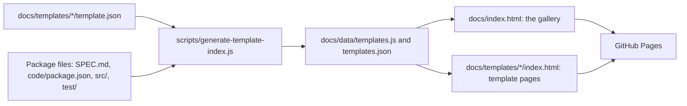
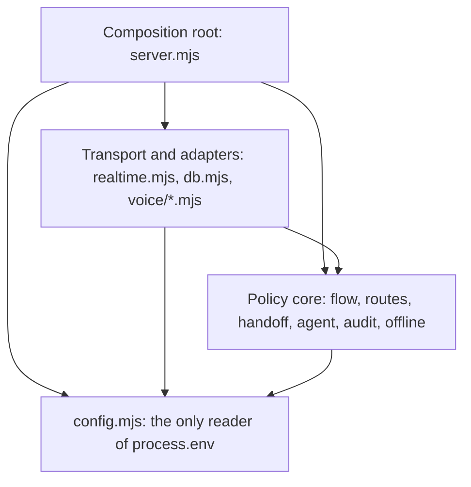
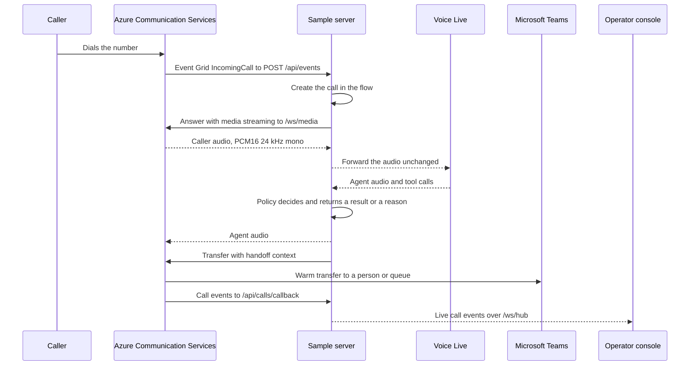

# Architecture and engineering standards

This document explains how the Voice AI Template Gallery is built and sets the
standards every template package must meet. It is written for contributors and for
coding agents such as GitHub Copilot. [CONTRIBUTING.md](CONTRIBUTING.md) covers the
workflow: proposing, building, and submitting a template.

The key words MUST, MUST NOT, SHOULD, SHOULD NOT, and MAY are to be interpreted as
described in [RFC 2119](https://www.rfc-editor.org/rfc/rfc2119).

[Intent-Based Call Routing](docs/templates/intent-based-call-routing/) is the reference
implementation. "The reference" below means that package. If this document and the
reference disagree, open an issue instead of picking one. To change a standard, open an
issue first, then update this document in the same pull request as the code.

New templates MUST meet these standards. Existing templates that predate a standard are
listed under [Known deviations](#7-known-deviations).

## Contents

1. [System overview](#1-system-overview)
2. [Gallery site](#2-gallery-site)
3. [Template package standard](#3-template-package-standard)
4. [Runnable sample architecture](#4-runnable-sample-architecture)
5. [Testing](#5-testing)
6. [Continuous integration](#6-continuous-integration)
7. [Known deviations](#7-known-deviations)

## 1. System overview

The gallery is a static site in `docs/`, published with GitHub Pages. The site has no
build step: one Node.js script validates every template manifest and writes the
catalogue the pages read.



```text
.github/
  dependabot.yml               Dependency update configuration
  workflows/validate.yml       Catalogue check and per-template test jobs
  workflows/pages.yml          Regenerates the catalogue and deploys docs/ to Pages
docs/
  index.html                   Gallery
  404.html, favicon.svg
  assets/                      gallery.js/.css and template-page.js/.css
  data/                        Generated catalogue: committed, never edited by hand
  schemas/template.schema.json Manifest schema for editors
  templates/<id>/              One self-contained package per template
scripts/
  generate-template-index.js   Catalogue validator and generator
ARCHITECTURE.md                This document
CONTRIBUTING.md                Contribution workflow
```

### Catalogue

`node scripts/generate-template-index.js`:

- Reads and validates every `docs/templates/<folder>/template.json`. Unknown fields
  (outside `paths`), missing required fields, and malformed nested objects fail the
  run. The field rules are summarized in
  [CONTRIBUTING.md](CONTRIBUTING.md#manifest-reference).
- Requires `id` to equal the folder name and to be unique.
- Requires every `paths` entry and every `ready` asset to exist, and every `pending`
  asset to be absent.
- Derives a `source` object from what is on disk:
  - `spec`: `templates/<folder>/SPEC.md` when it exists, otherwise `null`.
  - `runnable`: `true` when `code/package.json` exists.
  - `code`: which of `package.json`, `src/`, `test/`, `config/`, `knowledge/`, and
    `DEMO-SCRIPT.md` exist in `code/`.
- Writes each manifest plus its `source`, sorted by `name`, to
  `docs/data/templates.json` and `docs/data/templates.js`.

`templates.js` sets the globals `window.VOICE_AI_TEMPLATES` and `window.VOICE_AI_REPO`,
so pages work when opened from `file://`, with no server and no `fetch`.
`templates.json` holds the same data for tools. Both files are committed. CI regenerates
them and fails if the committed copy differs, so regenerate after you change a manifest
or add, remove, or rename files in a package.

`docs/schemas/template.schema.json` gives editors completion and validation through each
manifest's `$schema` key. The generator is the enforcement point. Keep the two in sync
when either changes.

`VOICE_AI_REPO` holds `{ owner, name, branch }` for "open on GitHub" links. It is `null`
in the committed data, where links fall back to relative paths. The Pages workflow sets
`INCLUDE_REPOSITORY_METADATA=1` when it deploys, so the live site links to GitHub. Don't
set that variable locally: CI compares against output generated without it. A maintainer
MAY commit `docs/data/repo.config.json` to override the metadata.

## 2. Gallery site

### Code

- `docs/assets/*.js` is ES5: an IIFE with `"use strict"`, using only `var` and
  `function`. No `let`, `const`, arrow functions, template literals, modules, or
  bundler.
- Render from the catalogue. Template copy, counts, and links come from
  `VOICE_AI_TEMPLATES`. Per-template code is limited to the
  [card scene registration](#gallery-card-scenes).
- Escape every catalogue value placed in HTML with `escapeHtml()`, which is defined in
  both `gallery.js` and `template-page.js`.
- Make no third-party requests: no CDNs, web fonts, analytics, or remote images.
  External URLs appear only as links that the visitor chooses to follow.
- Use relative paths, so every page works from `file://` and from the Pages URL.

### Template pages

`docs/templates/<id>/index.html` is a fixed stub. `template-page.js` finds the catalogue
entry named by `data-template-id` and renders the whole page, themed from the manifest.
Copy the stub from the reference and change only that attribute:

```html
<body data-template-id="intent-based-call-routing">
  <main id="template-page" aria-live="polite">Loading template…</main>
  <script src="../../data/templates.js"></script>
  <script src="../../assets/template-page.js" defer></script>
</body>
```

### Gallery card scenes

Each gallery card shows an illustrated scene. Register one for every new template:

| Registration | File | Notes |
|---|---|---|
| `VISUAL_SCENES["<id>"]` | `gallery.js` | The renderer reads `dataScene`, `ariaLabel`, `summary` (the card caption), and `content` (the viewer illustration). Existing entries also carry `outcomes` and `thumbnailContent`, which nothing reads yet; include them to match. Use the template id as both the key and the `dataScene` value. |
| `THUMBNAIL_EMBLEMS["<dataScene>"]` | `gallery.js` | Required. An SVG string with `class="thumbnail-svg" viewBox="0 0 120 84" aria-hidden="true"`, drawn with the `thumb-*` classes. Without it the card shows the text "undefined". |
| `/* 12. <dataScene> */` block | `gallery.css` | Rules scoped to `.visual-scene[data-scene="<dataScene>"]`, numbered after the last existing block. |
| `SCENE_ICONS` entry | `gallery.js` | Optional. Reuse an existing icon when one fits. |

Model all three on the `it-helpdesk-password-reset` entries: its `VISUAL_SCENES` entry,
its emblem, and CSS block 11.

- Style scenes with the shared `visual-*` classes and the `--visual-*` and `--t-*`
  custom properties, so each scene follows its template's theme. Don't hard-code
  colors.
- `ariaLabel` and `summary` describe the scene in words. The SVG inside is decorative.
- Check the scene at 600 px wide. If it overflows, add overrides inside the existing
  `@media (max-width: 600px)` block.
- Animation is decorative and CSS-only. The global `prefers-reduced-motion` block turns
  it off. Don't add motion that carries meaning or that bypasses that block.
- An unregistered template falls back to the routing scene. That keeps the gallery
  working; it isn't a substitute for registration.

### Theme and accessibility

The manifest's `colors` (`bg`, `panel`, `accent`, `ink`), `onAccent`, `font`, and
`radius` become the custom properties `--t-bg`, `--t-panel`, `--t-accent`, `--t-ink`,
`--t-on-accent`, `--t-font`, and `--t-radius` on the template's card and page.

Colors MUST meet these WCAG contrast ratios:

| Foreground on background | Minimum | Used for |
|---|---|---|
| `ink` on `bg`, and `ink` on `panel` | 7:1 | Body text (WCAG AAA) |
| `onAccent` on `accent` | 4.5:1 | Text on accent buttons and badges |
| `accent` on `bg` | 4.5:1 | Accent-colored text |
| `accent` on `panel` | 3:1 | Large text and interface components only |

Every current theme passes. [CONTRIBUTING.md](CONTRIBUTING.md#check-theme-contrast) has a
one-line check.

`font` MUST be a system font stack that ends in a generic family, because the site loads
no web fonts. `radius` is a CSS length such as `10px`.

### Caching

`docs/index.html` loads `assets/gallery.css`, `data/templates.js`, and
`assets/gallery.js` with a `?v=YYYYMMDD-N` query. When you change one of those files,
bump its version so returning visitors don't get a stale copy. Adding a template changes
all three.

### Featured template and the Copilot prompt

`FEATURED_TEMPLATE_ID` in `gallery.js` pins the reference template to the front; the
rest sort by name. Changing it is a maintainer decision.

Each template offers a prefilled GitHub Copilot session. The prompt is built from the
manifest (`name`, `language`, `prompt`, `business.application`, and `technical.build`)
and the derived `source` paths. It tells the agent to read `SPEC.md` first and treat its
decisions as requirements. For runnable templates, it also tells the agent to start from
`code/` and keep its offline mode and tests passing. If the encoded link would exceed
7,000 characters, a shorter prompt that points at `SPEC.md` and the template folder is
used instead. For authors, that means:

- People and agents both read manifest text. Write plain sentences without Markdown.
- `SPEC.md` is the contract an agent implements. State decisions, not options.
- Offline mode and the test suite are part of the template's interface. Keep them
  working.

## 3. Template package standard

A template is one folder, `docs/templates/<id>/`, that holds everything it needs:

```text
docs/templates/<id>/
  index.html             Page stub
  template.json          Manifest: the catalogue entry
  README.md              Package overview
  SPEC.md                Decisions of record
  code/                  Runnable sample (section 4)
    .env.example
    .gitignore
    DEMO-SCRIPT.md
    README.md            Implementation guide
    package.json
    package-lock.json
    config/              Policy data as JSON
    public/              Operator console
    scripts/             Smoke test and optional provisioning helpers
    src/                 Server, policy core, and adapters
      voice/             Azure Communication Services and Voice Live adapters
    test/                node:test suites
    knowledge/           Optional: retrieval content
  media/
    architecture.svg
    thumbnail.svg
  slides/
    README.md            Plus <id>.pptx, <id>.pdf, and preview.webp when ready
  video/
    README.md
    captions.vtt
    transcript.md        Plus demo.mp4 and poster.webp when ready
```

### Identity

The template id is a lowercase kebab-case slug that matches
`^[a-z0-9]+(?:-[a-z0-9]+)*$`. It MUST be identical in all of these places:

- The folder name, `docs/templates/<id>/`.
- `template.json`: `id`, and the `templates/<id>/` prefix of every `paths` and `assets`
  entry.
- `index.html`: `data-template-id`.
- `code/package.json`: `name`.
- `code/package-lock.json`: the top-level `name` and `packages[""].name`.
- `gallery.js`: the `VISUAL_SCENES` key and its `dataScene`.
- The slide files `slides/<id>.pptx` and `slides/<id>.pdf`.

An id is permanent once merged, because `templates/<id>/` is a public URL. To rename a
template, change its `name`.

### Media and deliverables

- `media/thumbnail.svg` and `media/architecture.svg` are hand-written SVGs with
  `viewBox="0 0 668 240"`, `role="img"`, `aria-labelledby="title desc"` with matching
  `<title id="title">` and `<desc id="desc">` elements, and
  `font-family="system-ui, sans-serif"`. Draw them in the media palette every template
  shares: `#101d20` for the background, `#173037` for boxes, `#5fd8d4` for strokes and
  connectors, and `#edffff` for text.
- SVGs MUST NOT contain scripts, external references, embedded raster images, or web
  fonts.
- The video and slide files are listed in `assets.expected`, each with
  `status: "pending"` until the real file exists. Change it to `"ready"` in the commit
  that adds the file. The generator fails on a `ready` asset that is missing and on a
  `pending` asset that is present, so placeholders can't be committed.
- GitHub rejects files over 100 MB and warns above 50 MB. Compress video for the web.

### Documentation

| File | Audience | Contents |
|---|---|---|
| `README.md` | Evaluators | Package contents, how to run the implementation, and common flows to test. |
| `SPEC.md` | Implementers and coding agents | The decisions of record, under the headings below. |
| `code/README.md` | Developers | What the demo shows, quick start, how it works, configuration, connecting a real phone number, project layout, security notes before production, and Microsoft references. |
| `code/DEMO-SCRIPT.md` | Presenters | A scripted walkthrough that works in simulation mode. |
| `code/.env.example` | Developers | Every variable `config.mjs` reads, grouped by concern, with placeholders or safe defaults and comments for anything that isn't obvious. No real values. |
| `video/README.md`, `captions.vtt`, `transcript.md` | Viewers | Video notes, WebVTT captions, and a transcript of the demo. |
| `slides/README.md` | Presenters | Slide notes and the required filenames. |

`SPEC.md` starts with `# <Name> — Sample Specification` and a `**Status:**` line, then
uses these `##` sections in this order:

1. Scope decisions
2. Implementation decisions
3. Experience decisions
4. Goal
5. Caller experience
6. Architecture and implementation shape
7. Teams handoff contract
8. Demo surface and configuration
9. Acceptance criteria
10. Production gates and non-goals
11. Microsoft reference contracts

Keep every heading. If one doesn't apply, say why under it. List every configuration
variable under "Demo surface and configuration".

## 4. Runnable sample architecture

Every template ships a runnable sample in `code/`. Samples are demo-grade, not
production software. A sample MUST run end to end offline, MUST work against real
Azure services once configured, and MUST document the production gates it doesn't
meet.

### Platform

- Node.js 22 or later with ES modules: `"type": "module"`, `.mjs` files,
  `"private": true`, and `"engines": { "node": ">=22" }`.
- Keep dependencies minimal. The reference uses six:
  `@azure/communication-call-automation`, `@azure/identity`, `better-sqlite3`, `dotenv`,
  `express`, and `ws`. Explain any new dependency in the pull request. Don't add dev
  dependencies: tests use the built-in `node:test` runner.
- Commit `package-lock.json` and install with `npm ci`. Lockfiles SHOULD resolve
  packages from the public npm registry (see [Known deviations](#7-known-deviations)).
- Telephony uses Azure Communication Services Call Automation, the voice agent uses the
  Voice Live API, and people are reached through Microsoft Teams.
- Authenticate without keys by default, with `DefaultAzureCredential` from
  `@azure/identity` (Microsoft Entra ID). A connection string or API key MAY be accepted
  as an explicit fallback, read only from the environment. Never commit secrets.

### npm scripts

| Script | Reference command | Needs `npm ci` |
|---|---|---|
| `start` | `node src/server.mjs` | Yes |
| `dev` | `node --watch src/server.mjs` | Yes |
| `test` | `node --test test/*.test.mjs` | No |
| `check` | `node --check` on every `src/*.mjs` and `src/voice/*.mjs` file | No |
| `smoke` | `node scripts/smoke-websockets.mjs` | Yes |
| `tunnel` | `devtunnel host -p <port> --allow-anonymous` | No, but needs the Dev Tunnels CLI |

### Layering



Arrows show the allowed import direction. Nothing imports against them.

1. **Policy core.** The call state machine, business policy, handoff payloads, agent
   instructions and tool definitions, audit interfaces, and offline simulation. Core
   modules MUST import only Node.js built-ins, other core modules, and `config.mjs`.
   They MUST NOT import npm packages or adapters. That keeps `npm test` working with no
   install, and CI runs the tests before `npm ci` to prove it.
2. **Configuration.** `config.mjs` is the only module that reads `process.env`. It loads
   `dotenv` through a guarded dynamic `import()`, so it works in a bare clone, applies
   defaults, and exports pure helpers such as `assertCallConfig()`, which returns the
   settings that live calls still need.
3. **Transport and adapters.** WebSockets (`realtime.mjs`), persistence (`db.mjs`),
   Call Automation (`voice/acs.mjs`), the media bridge (`voice/call-bridge.mjs`), and the
   Voice Live client (`voice/voice-live.mjs`). Adapters MAY import npm packages and core
   modules.
4. **Composition root.** `server.mjs` loads configuration and policy data, builds the
   adapters, injects them into the flow, and registers HTTP and WebSocket routes. An
   adapter that wraps a native dependency is loaded with a dynamic `import()` inside a
   `try`, with an in-memory fallback, so the demo still starts if the native build
   failed. The reference does this for `db.mjs` and `better-sqlite3`.
5. **Dependency injection.** The flow receives its collaborators through its
   constructor, for example
   `new RoutingFlow({ routes, callers, audit, transfer, hub, now, options })`. Tests pass
   fakes; simulation passes `transfer = null`.

Policy data, such as routes, schedules, and directories, lives in JSON under
`code/config/` with fictional values. Real tenant identifiers go in git-ignored
`config/*.local.json` files, selected through environment variables (`ROUTES_PATH` in
the reference).

### Inbound call path



### Event intake

Inbound templates receive calls through an Event Grid subscription that posts to
`POST /api/events`. The handler MUST:

1. Answer `Microsoft.EventGrid.SubscriptionValidationEvent` first, returning
   `{ validationResponse }`.
2. Acknowledge with `200` before doing any other work. Event Grid treats a slow
   response as a failure and delivers the event again.
3. Handle only `Microsoft.Communication.IncomingCall` events, and deduplicate them by
   `event.id`, because Event Grid can deliver an event more than once.
4. Keep correlation identifiers, such as an Auto Attendant session id, on the call.
5. Log masked phone numbers only.

`POST /api/calls/callback` receives Call Automation events and also acknowledges right
away. It identifies the call by a `?call=` query parameter that the server adds to the
callback URL.

### Media and voice

- Answer with media streaming in `pcm24KMono`, sent to `/ws/media`.
- The bridge forwards base64 PCM16, 24 kHz mono audio between Azure Communication
  Services and Voice Live in both directions, unchanged. Don't resample or transcode.
- Configure the Voice Live session with `pcm16` input and output, `azure_semantic_vad`
  turn detection, `azure_deep_noise_suppression`, and `server_echo_cancellation`.
- Support barge-in. When Voice Live reports `input_audio_buffer.speech_started`, send
  Azure Communication Services a `StopAudio` message so queued agent audio stops at
  once.
- Log `MediaStreamingFailed` callbacks with their result code and message. Otherwise,
  a media WebSocket that never connected shows up only as a silent call.

### The model talks, the server decides

The language model runs the conversation; the server owns every decision that has
consequences. Each Voice Live tool call maps to one flow method. In the reference,
`propose_route` calls `proposeRoute()`, `confirm_route` calls `confirmRoute()`, and
`request_human` calls `requestHuman()`. Each method checks the request against the call
state and policy, then returns a result or `{ ok: false, reason }`, such as
`nothing_to_confirm`. The model receives that result and must recover; it can't move a
call into a state the flow doesn't allow. Every tool call and its outcome is recorded in
the call's audit trail. Terminal states, `TRANSFERRED` and `ENDED`, are final.

### Time

Policy that depends on time, such as business hours, on-call rotations, appointment
slots, or reminders, MUST take an injectable clock (`now = Date.now` in the reference
flow). Samples SHOULD also accept `DEMO_NOW`, an ISO 8601 timestamp read in `config.mjs`,
to pin the clock for demos, tests, and smoke runs.

### Offline-first simulation

Every sample MUST start and be demonstrable with no Azure configuration:

- When settings for live calls are missing, the server starts in simulation mode and
  says so at startup, naming what is missing:
  `SIMULATION MODE    — set <missing> to answer real calls`. In live mode, it prints the
  voice model and the public URL instead.
- `GET /health` reports `ok`, `mode` (`"live"` or `"simulation"`), `callReady`, and
  `missingConfig`, plus the audit store, the realtime transport, and template-specific
  readiness.
- Adapters with external effects are injected, and in simulation they're `null` or
  stubs. The reference passes `transfer = null`: the flow still builds the real handoff
  context, then records a simulated transfer.
- `POST /api/simulate` and its `/:id/say`, `/:id/dtmf`, `/:id/silence`, and
  `/:id/hangup` routes drive a whole call from the operator console or `curl`.

### Outbound and campaign safety

Outbound templates place calls, so they need extra guardrails. Templates that dial a
list or batch MUST provide these settings, or equivalents, with safe defaults:

| Setting | Default | Meaning |
|---|---|---|
| `CAMPAIGN_ENABLED` | `false` | Nothing is dialed automatically until this is enabled. |
| `CAMPAIGN_DRY_RUN` | `true` | Plans calls without dialing. |
| `CAMPAIGN_MAX_CONCURRENT` | A small number, such as `2` | Caps simultaneous calls. |
| `ALLOWED_TEST_NUMBERS` | Empty | Numbers that may be dialed outside production. |

New templates SHOULD fail closed: an empty allow-list permits no live calls. Document
consent and permitted calling hours in `SPEC.md` under "Production gates and
non-goals".

### HTTP and WebSocket surface

New templates MUST expose:

| Route | Purpose |
|---|---|
| `GET /health` | Mode, readiness, and missing settings |
| `POST /api/events` | Event Grid intake (inbound templates) |
| `POST /api/calls/callback` | Call Automation events |
| `GET /api/calls/:id` | Call snapshot |
| `GET /api/calls/:id/events` | Audit trail for a call |
| `GET /api/stats` | Counters for the console |
| `POST /api/negotiate` | Console WebSocket negotiation |
| `POST /api/simulate` and its sub-routes | Offline call driver |
| `/ws/hub` | Live events for the console |
| `/ws/media` | Media stream from Azure Communication Services |

Route WebSocket upgrades through one `server.on("upgrade")` handler that dispatches by
path and destroys the socket for unknown paths. Don't attach several
`new WebSocketServer({ server, path })` instances to one HTTP server: each rejects the
upgrades meant for the others. The `ws` documentation shows the shared-server pattern.

### Operator console

`code/public/` is a small console served by `express.static`. It talks only to its own
origin (`/health`, `/api/*`, and `/ws/hub`) and loads nothing from third parties. Unlike
the gallery, it MAY use modern JavaScript, such as `<script type="module">`, `const`, and
arrow functions, because it's a developer tool opened in a current browser.

### Data, privacy, and security

- Use synthetic data only. Every name, number, and record in `config/`, tests, docs, and
  media is fictional.
- Mask phone numbers in logs, the console, and audit records (`maskPhone()` in the
  reference).
- Persisting transcripts is opt-in (`PERSIST_TRANSCRIPTS=true`). By default, the audit
  store keeps call state and events only.
- `code/.gitignore` MUST cover `node_modules/`, `data/`, `.env`, and
  `config/*.local.json`. `.env.example` holds no real values.
- Bind to `127.0.0.1` by default. Live calls need a public URL, a dev tunnel in the
  reference. Treat that URL as public, because it also exposes the console and the
  simulation routes, and close the tunnel when you're done.
- Say what a production deployment must add, such as authentication for callbacks and
  the console, retention, consent, and abuse controls, under "Security notes before
  production" in `code/README.md` and "Production gates and non-goals" in `SPEC.md`.

### Ports

Each sample has its own default port, so several can run side by side. A new template
claims the next free port from 8101 up in its proposal issue and adds a row here in its
pull request. Its smoke test uses the demo port plus 100. Pick ports that don't appear
anywhere in this table.

| Template | Demo port | Smoke test port |
|---|---|---|
| `it-helpdesk-password-reset` | 8090 | No smoke test |
| `intent-based-call-routing` | 8091 | 8199 |
| `general-inquiry-agent` | 8092 | 8292 |
| `after-hours-sales-lead-capture` | 8093 | 8193 |
| `bid-price-lookup-agent` | 8094 | 8199 |
| `contextual-on-call-pager` | 8095 | 8195 |
| `311-service-assistant` | 8096 | Needs a running server |
| `customer-record-lookup-update` | 8097 | Needs a running server |
| `it-hr-help-desk-triage` | 8098 | Needs a running server |
| `appointment-reminder-agent` | 8099 | Needs a running server |
| `appointment-scheduling-agent` | 8100 | Needs a running server; defaults to 8099 |

## 5. Testing

Run the cheapest checks first:

| Tier | Command | Needs `npm ci` | Covers |
|---|---|---|---|
| Unit | `npm test` | No | State machine, policy, handoff payloads, and configuration helpers, with fakes for every adapter |
| Syntax | `npm run check` | No | Every server module parses |
| Smoke | `npm run smoke` | Yes | The server boots, `/health` answers, and every WebSocket path accepts an upgrade |
| Manual | `code/DEMO-SCRIPT.md` | Yes | The scripted demo in simulation mode, then a real call |

Unit tests:

- Import only policy core modules and `config.mjs`.
- Pin time with the injected clock.
- Cover every state transition, every `{ ok: false, reason }` guard, fallbacks such as
  no input and out-of-scope requests, transfer failure, and the handoff payload.

Smoke tests:

- Start their own server with `process.execPath` on the demo port plus 100, with
  `HOST=127.0.0.1`, `DB_PATH=:memory:`, and every live setting
  (`ACS_ENDPOINT`, `ACS_CONNECTION_STRING`, and `VOICE_LIVE_ENDPOINT`) set to an empty
  string. `dotenv` doesn't override variables that are already set, so the run stays in
  simulation mode even when a developer has a local `.env`. Also set `DEMO_NOW` when
  behavior depends on time.
- Poll `/health`, open every WebSocket path, and stop the server on exit, whether the
  run passed or failed.
- MUST NOT need an already running server or any network access beyond localhost.

## 6. Continuous integration

`.github/workflows/validate.yml` runs on every pull request and on pushes to `main`,
with read-only `contents` permission:

- `catalogue` runs the generator, then `git diff --exit-code -- docs/data` to prove the
  committed catalogue is current.
- `call-routing-demo` is the model template job. It runs `npm test` before `npm ci`,
  which proves the policy core needs no dependencies, then `npm ci`, `npm run check`,
  and `npm run smoke`. `password-reset-demo` predates it and has no smoke step.

A new template MUST add its own job, copied from `call-routing-demo` with `cache: npm`
and `cache-dependency-path` added, and an `npm` entry for its `code/` directory in
`.github/dependabot.yml`.

`.github/workflows/pages.yml` runs on pushes to `main`. It regenerates the catalogue
with repository metadata and deploys `docs/` to GitHub Pages.

## 7. Known deviations

These templates predate parts of this standard. Don't copy these patterns into new
templates. Fixes are welcome as separate pull requests.

| Area | Deviation |
|---|---|
| Password reset | `it-helpdesk-password-reset` predates the standard: it has no `SPEC.md`, no `config/`, no smoke test, and no `/api/simulate` or `/api/calls/:id/events` routes, and its modules are laid out differently. |
| On-call pager | `contextual-on-call-pager` has no `/api/simulate` or `/api/calls/:id/events` routes. |
| CI | Only `intent-based-call-routing` and `it-helpdesk-password-reset` have CI jobs, and Dependabot covers only `it-helpdesk-password-reset`. |
| Package READMEs | Nine package `README.md` files are a generic paragraph. `intent-based-call-routing` shows the expected content. |
| `code/README.md` | Headings vary between templates. |
| Smoke tests | Smoke ports don't consistently follow the demo port plus 100 rule: `intent-based-call-routing` and `bid-price-lookup-agent` both use 8199, and `general-inquiry-agent` uses 8292. Five smoke tests need an already running server, and the `appointment-scheduling-agent` smoke test defaults to port 8099 instead of 8100. |
| Simulation banner | `appointment-reminder-agent`, `appointment-scheduling-agent`, `contextual-on-call-pager`, and `customer-record-lookup-update` don't print the simulation-mode banner. |
| Clock | `intent-based-call-routing` injects `now` but doesn't read `DEMO_NOW`. |
| Campaign safety | `appointment-reminder-agent` treats an empty `ALLOWED_TEST_NUMBERS` as "no restriction". Set it before you turn off `CAMPAIGN_DRY_RUN`. |
| Card scenes | Ten templates use older `VISUAL_SCENES` keys, mapped through `LEGACY_KEY_BY_ID` in `gallery.js`. New templates key scenes by id. |
| Lockfiles | Ten `package-lock.json` files resolve packages from Microsoft-hosted Azure Artifacts feeds instead of the public npm registry. Fix them together in one pull request, not template by template. |
